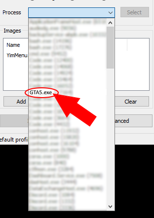

# YimMenu Installation (~~for dummies~~ smart people)

### Steps to install YimMenu 😃

1) [Download the .dll file from official github repository. (if you click this text, it opens the link to the download)](https://github.com/YimMenu/YimMenu/releases/download/nightly/YimMenu.dll)

2) Download a .dll injector. For example Xenos. Click [here](#xenos-tutorial) for tutorial on how to do it with Xenos.

3) After you injected YimMenu into GTA for the first time, you can set the menu key (to open a close the menu), menu and game language, and more.

4) After you set everything up, a pop-up talking something about the "Game cache" may appear. Just press `Update cache` or related. After a few seconds or minutes (if potato pc), you should be ready to go.

5) If you need help installing scripts, you can look at this [tutorial here](https://github.com/pierrelasse/YimStuff/blob/master/docs/YimMenuScripts.md).

# Xenos Tutorial

### Steps to inject a .dll using Xenos

1) Download Xenos from [here](https://github.com/DarthTon/Xenos/releases/download/2.3.2/Xenos_2.3.2.7z).

2) (optional) The downloaded file is a .7z file. This means you need to open it with a program that can open such a file. 7z, WinRAR, and probably other programs can open it. To download 7z, go [here](https://www.7-zip.org/download.html). To download WinRAR, go [here](https://www.win-rar.com/download.html).

3) Extract the `Xenos64.exe` file from the .7z archive. For example put it on your desktop.

4) Run the `Xenos64.exe` file by double clicking it with the left mouse button. A window that says something about "changes on your computer" can pop up. Just press `Yes` to allow very good dll injection.

5) You should see the following window pop up. 

6) Now you will need to drag in the previously downloaded .dll file called `YimMenu.dll` (or related). You do this by holding the left mouse button while hovering with the mouse cursor over the `YimMenu.dll` (or related) file. Then move the mouse cursor over the "Images" box. Picture: 
 
Now release the left mouse button. The "Images" box should now look like this: 

7) Now you will need to start gta like you always do. After gta 5 is fully launched and you loaded into Story Mode, you need to select the GTA5.exe process.

8) To select the GTA5.exe process, click on the processes dropdown. 

9) Then search for the GTA5.exe item. *Your item location may differ from the image.* 

10) Just press the `Inject` button and you're done with injecting YimMenu into GTA V. 

11) For help from the community and/or contributors, you can start a discussion [here](https://github.com/YimMenu/YimMenu/discussions).
