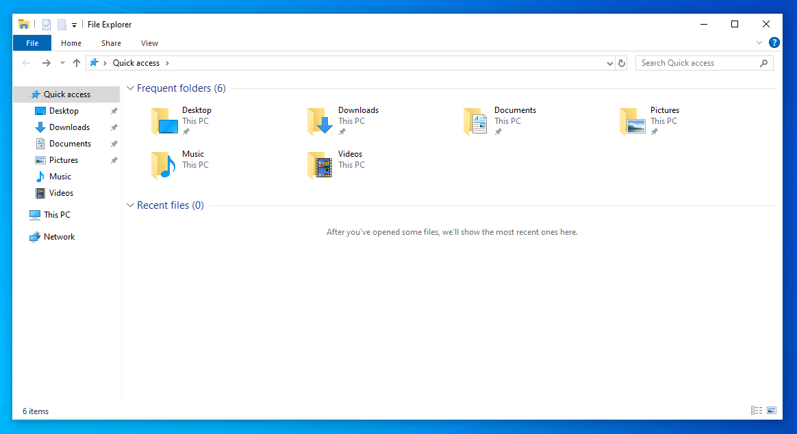
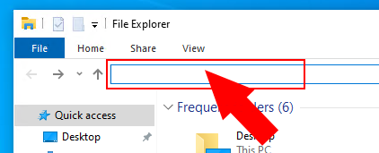
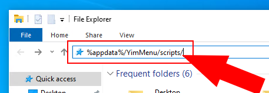
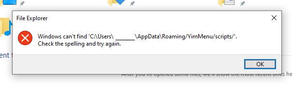
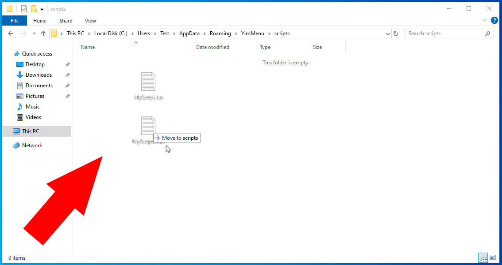

# YimMenu Script Installation (~~for dummies~~ smart people)

### Steps to install a Lua Script for YimMenu 😃

*for fast people: folder is located at `%appdata%/YimMenu/scripts/`*

1) Download a Lua Script for YimMenu. The final file should end with `.lua`. The downloaded file can also be a `.zip`, `.rar`, and so on. In that case, you will need to extract the lua files first.

2) After you have your script (or multiple scripts), you need to put them into your scripts folder.

3) To do this, open the file explorer. 

4) Then, click on the path box to change the current path. 

5) Type `%appdata%/YimMenu/scripts/` into the selected text box and press enter. 

6) If you recive the following error, make sure you have used YimMenu before (launched gta and injected YimMenu. You can find a tutorial [here](https://github.com/pierrelasse/YimStuff/blob/master/docs/YimMenuInstallation.md)). 

7) Now that you've navigated to the scripts folder, place your script file(s) inside. 

8) Now you just have to start GTA V and inject YimMenu, or reload all lua scripts in `Settings->Lua Scripts` and press the `Reload All` button (or related).

### Finding scripts

- [Looking in the YimMenu-Lua organization](https://github.com/YimMenu-Lua).
- [Searching for them on github](https://github.com/search?q=YimMenu+Scripts&type=repositories).
- Using the script found in this repo :)))))) #ad
